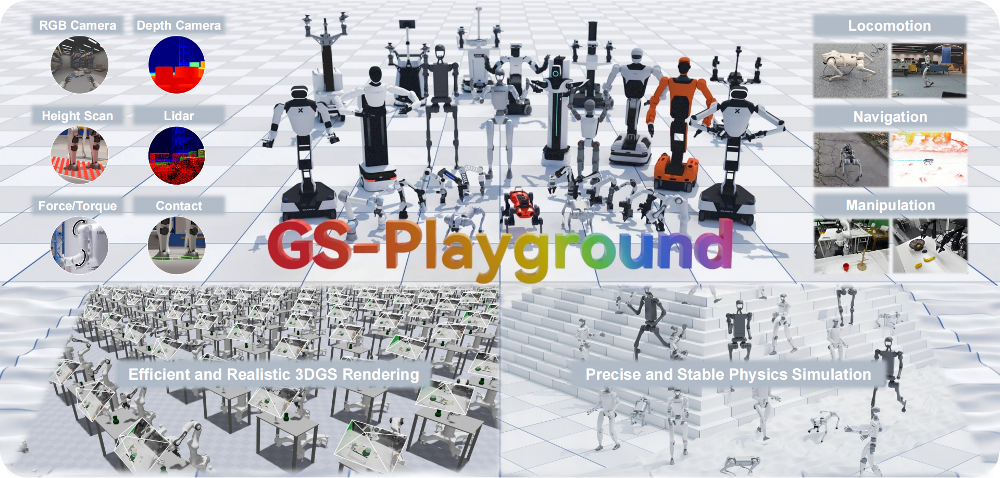

<h1 align="center">GS-Playground</h1>

<h3 align="center">A High-Throughput Photorealistic Simulator for Vision-Informed Robot Learning</h3>

Languages: English | [简体中文](README_CN.md)

<p align="center">
  <a href="https://gsplayground.github.io"></a>
  <a href="https://arxiv.org/abs/XXXX.XXXXX"></a>
  <a href="https://huggingface.co/gsplayground"></a>
  
</p>

<p align="center">
  <strong>🎉 Accepted to RSS 2026 🎉</strong>
</p>

<p align="center">
  
</p>

GS-Playground is a high-throughput photorealistic simulation framework for vision-informed robot learning. It couples a parallel robot physics engine with batch 3D Gaussian Splatting (3DGS) rendering, enabling large-scale visual reinforcement learning with real-world appearance, rigid-link visual synchronization, and sim-ready assets.

This repository is currently an early public preview. It contains a minimal batch rendering benchmark and two minimal demos. The full simulator, assets, datasets, training code, and evaluation suite will be released in stages.

## 📰 News

- **2026-04-28:** GS-Playground was accepted to **RSS 2026**.

## ✨ Highlights

- **Photorealistic visual simulation:** Batch 3DGS rendering for RGB and depth observations in robot learning loops.
- **High-throughput perception:** The paper reports up to `10^4` FPS at `640 x 480` resolution with batch rendering and memory-efficient 3DGS assets.
- **Rigid-Link Gaussian Kinematics:** 3DGS clusters are bound to simulator rigid bodies for temporally consistent robot and object motion.
- **Parallel physics engine:** A velocity-impulse solver designed for stable contact-rich robot tasks and large time steps.
- **Real2Sim asset workflow:** A pipeline for reconstructing photorealistic, physically consistent, memory-efficient scenes from real captures.
- **Multi-embodiment scope:** Experiments cover locomotion, navigation, and manipulation, including quadrupeds, humanoids, and robot arms.

## 📦 Current Release

The current repository is intentionally small and intended for early reproduction of the rendering interface and example assets:

- [x] `benchmark/`: minimal batch rendering notebook and helper scripts.
- [x] `demo/live_demo/`: minimal replay demo with local Franka/Robotiq assets and replay data.
- [x] `demo/navigation/`: minimal robot navigation demo with Go1, Go2, and G1 policy assets.

Large-scale training pipelines, full benchmark suites, generated 3DGS asset collections, Real2Sim tools, and paper experiment configurations are not included in this preview release yet.

## 🛠️ Installation

Run all commands from this repository root.

```bash
# Skip this line if uv is already installed.
curl -LsSf https://astral.sh/uv/install.sh | sh

git clone https://github.com/discoverse-dev/gs_playground.git
cd gs_playground
UV_CACHE_DIR=.uv-cache uv sync --reinstall-package motrixsim-core
```

Dependency versions and platform markers are tracked in `pyproject.toml` and `uv.lock`.

## 🚀 Quick Start

### Live Replay Demo

```bash
UV_CACHE_DIR=.uv-cache uv run python demo/live_demo/replay.py
```

### Navigation Demo

```bash
UV_CACHE_DIR=.uv-cache uv run python demo/navigation/robot_locomotion.py --config configs/go2_scene1.json
UV_CACHE_DIR=.uv-cache uv run python demo/navigation/robot_locomotion.py --config configs/g1_scene1.json
```

### Batch Rendering Benchmark

```bash
UV_CACHE_DIR=.uv-cache uv run jupyter nbconvert \
  --to notebook \
  --execute benchmark/mtx_batch_minimal.ipynb \
  --ExecutePreprocessor.cwd=benchmark \
  --output mtx_batch_minimal.executed.ipynb
```

### Optional Jupyter Kernel

```bash
UV_CACHE_DIR=.uv-cache uv run python -m ipykernel install \
  --user \
  --name gsp-render-dev \
  --display-name "gsp-render-dev"
```

## 🗺️ Release Plan

The paper system is larger than this preview repository. Planned releases:

- [ ] Core simulator API for batched robot simulation, synchronized 3DGS observations, RGB/depth cameras, contacts, and MJCF-compatible assets.
- [ ] Batch 3DGS renderer kernels, pruning utilities, memory-efficient asset loading, and multi-scene batching examples.
- [ ] Real2Sim tools for scene/object segmentation, inpainting, 3DGS/mesh reconstruction, pose alignment, collision synchronization, and asset packaging.
- [ ] Sensor modules for depth, contact, and batch LiDAR examples.
- [ ] PPO and visual policy training scripts for locomotion, vision-centric navigation, and manipulation.
- [ ] Benchmark suite for visual fidelity, rendering throughput, physics stability, locomotion, navigation, and manipulation experiments from the RSS 2026 paper.
- [ ] Hugging Face release with compressed 3DGS assets, example scenes, robot assets, trained policies, and evaluation traces.

## 🔗 Related Projects

GS-Playground builds on several components and prior systems from our ecosystem. They are not fully integrated into this preview repository yet; future releases will consolidate the relevant physics, rendering, sensing, and learning interfaces into the GS-Playground workflow described in the RSS 2026 paper.

- **Physics simulator:** [MotrixSim](https://github.com/Motphys/motrixsim-docs) provides the robot physics backend behind the high-throughput contact-rich simulation stack.
- **State-based RL:** [MotrixLab](https://github.com/Motphys/MotrixLab) contains state-based reinforcement learning infrastructure that will be connected to the GS-Playground training pipeline.
- **RLGK rendering:** [GaussianRenderer](https://github.com/discoverse-dev/GaussianRenderer) includes the Gaussian rendering components related to Rigid-Link Gaussian Kinematics.
- **Batch LiDAR:** [MuJoCo-LiDAR](https://github.com/discoverse-dev/MuJoCo-LiDAR) is our earlier batch LiDAR module; the GS-Playground sensor suite will integrate this line of work for navigation and locomotion tasks.
- **Previous-generation platform:** [DISCOVERSE](https://github.com/discoverse-dev/discoverse/) is our earlier embodied simulation platform. GS-Playground can be viewed as a next-generation, photorealistic and high-throughput successor to DISCOVERSE.

## 📚 Citation

```bibtex
@article{jia2025discoverse,
      title={DISCOVERSE: Efficient Robot Simulation in Complex High-Fidelity Environments},
      author={Yufei Jia and Guangyu Wang and Yuhang Dong and Junzhe Wu and Yupei Zeng and Haonan Lin and Zifan Wang and Haizhou Ge and Weibin Gu and Chuxuan Li and Ziming Wang and Yunjie Cheng and Wei Sui and Ruqi Huang and Guyue Zhou},
      journal={arXiv preprint arXiv:2507.21981},
      year={2025},
      url={https://arxiv.org/abs/2507.21981}
}
```
